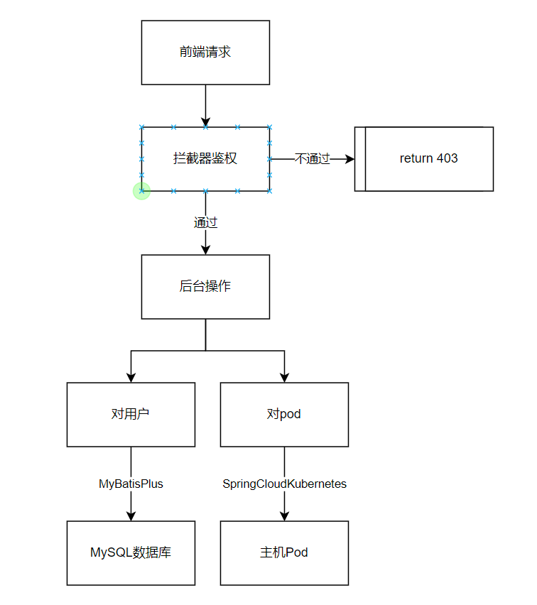

SpringBoot-Vue实现对k8s的管理设计方案

## 0.开发背景

应实验室需求，开发此前后端分离Web项目，实现用户在网页对Pod申请，得到Pod信息后可以使用ssh连接。管理员可以简单管理用户和Pod。

## 1.开发环境

操作系统：windows11

使用的工具：Git+IDEA+VSCode+MySQLWorkBrench+docker

使用的框架（组件）：Maven+MybatisPlus+Swagger+JWT+SpringCloudKubernetes

数据库：MySQL

## 2.后端部分

GitHub：[GitHub - Gohoy/k8s-web-backend](https://github.com/Gohoy/k8s-web-backend)

### 2.1数据库部分：

数据库名称为：k8s

只有一张表：users，文件见Github：resource/k8s-users.mysql

#### 表user字段说明

| ColumName | id  | username | password | ctr_occupied | ctr_name | ctr_max | vm_occupied | vm_name | vm_max | is_admin | token | last_login |
| --- | --- | --- | --- | --- | --- | --- | --- | --- | --- | --- | --- | --- |
| describe | 主键  | 用户名，不可重复 | 密码  | 已经申请的container数量 | 已经申请的container的名称 | 最多可以申请的container数量 | 已经申请的虚拟机的数量 | 已经申请的虚拟机的名称 | 最多可以申请的虚拟机的数量 | 是否是管理员 | 用于验证身份的token | 上次登录时间 |
| notNull | yes | yes | yes |     |     |     |     |     |     | yes | yes |     |
| default |     |     |     | 0   | null | 1   | 0   | null | 1   | 0   |     | null |
| autoIncrease | yes |     |     |     |     |     |     |     |     |     |     |     |

## 2.2后台架构说明

### 2.3具体实现

#### 2.3.1拦截器

前提（前后端统一）：在登录注册时，后台会通过JWT返回token，前端使用HttpOnly Cookie + CORS存放token和用户名，并在之后请求中携带。

有两个拦截器：

- LoginInterceptor：

    - 作用：判断用户是否已经登录
    - 原理：判断token包含的username是否和请求携带的username相同
    - 拦截范围：`/user/login`和`/user/register`之外的所有地址。
    - 开发阶段可以开启Swagger的权限
        - `"/swagger-ui.html", "/swagger-ui/**", "/webjars/swagger-ui/**", "/v3/api-docs/**"`
        - 这些都需要添加，否则Swagger无法正常访问
- AdminInterceptor

    - 作用：判断用户是否是管理员

    - 原理：使用请求携带的username从数据库中访问字段is_admin，得到结果。

    - 拦截范围：`/admin/**`

